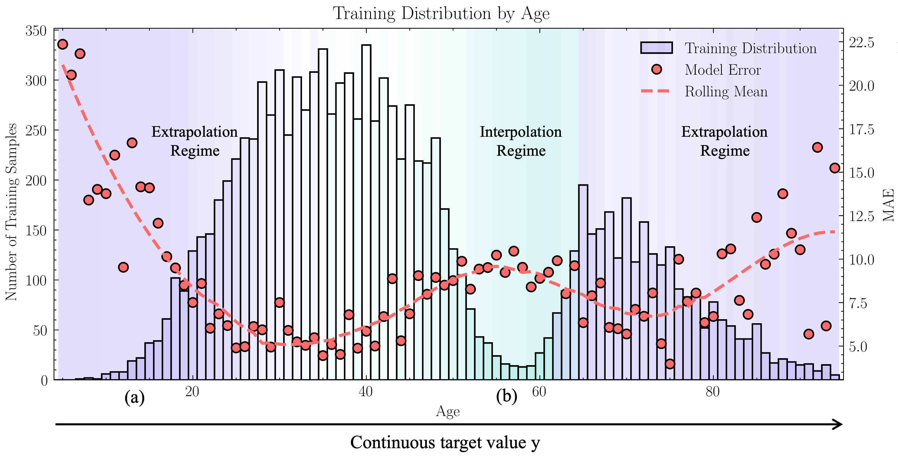
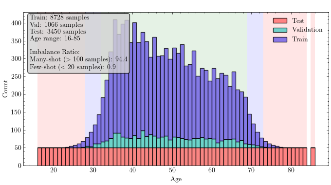
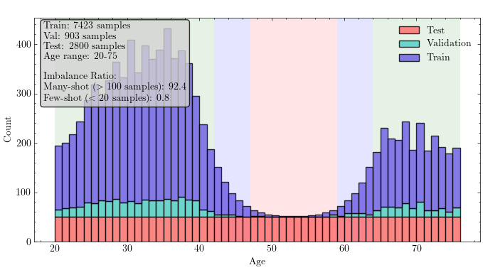
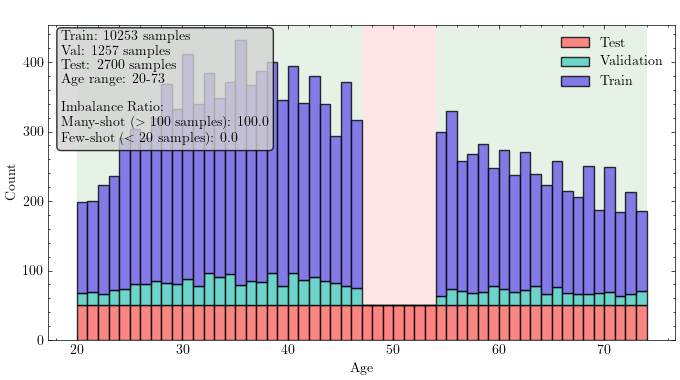

# Deconstructing Deep Imbalanced Regression: A Comprehensive Review and Experimental Evaluation

This repository is the official companion code for the paper **"Deconstructing Deep Imbalance Regression: A Comprehensive Review and Experimental Evaluation"**.

It contains a standardized, open-source reimplementation of **12 State-of-the-Art (SOTA) methods** for Deep Imbalanced Regression (DIR), along with the code to replicate our proposed benchmark suite (Extrapolation, Interpolation, and Blind-Spot protocols).

-----

## 📖 About the Paper

**Abstract:** In real-world applications, there is often a fundamental problem: the data most critical to predict interesting events, anomalies, and high-stakes outliers are often the rarest, while less interesting data is abundant. Although deep learning is often used specifically for these difficult prediction tasks, data-driven models inevitably fail in underrepresented areas. This discrepancy between the empirical data distribution and the desired performance creates a severe target distribution shift. Deep imbalanced regression (DIR) has emerged explicitly to address this challenge, which is particularly acute for continuous targets where conventional classification-based method are often ill-suited.

This paper follows a two folded approach. We start by providing the first comprehensive review of the DIR landscape by introducing a novel two-axis taxonomy that disentangles challenges along a Data Axis and a Deep-Learning Axis. We theoretically ground the failure of deep models in rare data regimes through the cascading mechanism of "Shared Capacity","Biased Update", and "Manifold Distortion". Within this framework, we systematically review 19 state-of-the-art methods across Architectural, Algorithm-Level, and Representation Learning categories.

Then to ground our analysis, we conduct an extensive empirical re-evaluation of twelve open-source methods. We propose an improved benchmark suite comprising three targeted protocols: Balanced Extrapolation, Bimodal Interpolation, and Blind-Spot Isolation, that statistically stress-test generalization across the full target range. Our study underscores the significant impact of imbalance on regression accuracy, offering a conceptual framework and practical benchmarks to catalyze further development of systems capable of capturing the rare as reliably as the common.

* **Figure 1:** An illustration of the DIR problem. Standard models fail in sparse regions (a) unless supported by neighbors (b). Our taxonomy explores why this happens and how specific methods address it.*

-----

## 🧪 Evaluation Protocols

Standard benchmarks (like the default AgeDB split) often mask specific model failures. To rigorously stress-test DIR methods, we introduce three new statistical protocols included in this repository:

1. **Balanced Extrapolation:** Tests the model's ability to generalize to tail-end values (ages 16-85) where training data is scarce or non-existent.

<center>

</center>

2. **Bimodal Interpolation:** Creates a gap in the training distribution (removing ages 36-64) to test if the model can bridge data-rich regions.

<center>

</center>

3. **Blind-Spot Isolation:** Completely removes a specific target interval (ages 47-53) from training to test zero-shot generalization capabilities.

<center>

</center>

-----

## 🔑 Key Insights & Results

Based on our extensive empirical re-evaluation, we identify three major findings regarding the current DIR landscape:

### 1\. Non-Orthogonal Methods are the current SOTA

Methods that require architectural changes or complex training pipelines—specifically **UVOTE**, **RnC**, and **VIR**—consistently outperform others.

* **UVOTE** is the most reliable specialist for few-shot regions.
* **RnC** provides the best overall performance across regimes.
* **VIR** offers a strong balance with calibrated uncertainty.

### 2\. The "Tail-Booster" Trade-off

Algorithm-level methods that modify the loss function, such as **LDS** and **SQINV**, act as dedicated "tail boosters." They achieve significant gains in few-shot regions ($\approx +15\%$) but often at the cost of degraded performance in many-shot regions ($-5\%$).

### 3\. Representation Learning offers Low-Risk Gains

Orthogonal regularizers like **ConR** and **RankSim** provide steady, reliable improvements ($\approx 4-10\%$) without significant downsides. They are highly compatible when stacked with other methods.

### 4\. Stability Analysis

While most methods are stable in data-rich regimes ($\sigma \approx 0.15$), performance in the few-shot tail is volatile. Notably, combining **RRT + RankSim** proved significantly unstable in extrapolation settings ($\sigma > 0.9$), suggesting antagonistic interactions between two-stage training and ranking regularization.

-----

## 🚀 Getting Started

### Installation

```bash
# Clone the repository
git clone https://github.com/username/repo-name.git
cd repo-name

# Install dependencies
pip install -r requirements.txt
```

### Dataset Preparation

This repository uses the **AgeDB** dataset. Please ensure the data is placed in the `data/` directory.

* *Note: Detailed instructions on formatting the CSV files for the custom protocols are found in `data/README.md`.*

-----

## 💻 Reproduction

We provide a detailed command log to reproduce every single experiment reported in the paper.

👉 **[Click here for the full list of REPRODUCTION COMMANDS](REPRODUCTION_COMMANDS.md)**

### Quick Start Example

To train the **Vanilla (ResNet-50)** baseline on AgeDB:

```bash
python3 agedb_dir_conr/train.py \
    --epoch 120 \
    --batch_size 256 \
    --store_name backbone \
    --dataset agedb \
    --output_csv "agedb_output_seed_42.csv" \
    --seed 42 \
    --name vanilla[agedb]
```

To train a **LDS (Label Distribution Smoothing)** model:

```bash
python3 agedb_dir_conr/train.py \
    --lds True \
    --lds_ks 5 \
    --lds_sigma 2 \
    --reweight sqrt_inv \
    --epoch 120 \
    --batch_size 256 \
    --dataset agedb \
    --output_csv "agedb_output_seed_42.csv" \
    --seed 42 \
    --name vanilla+lds[agedb]
```

-----

## 📊 implemented Methods

The table below provides a comprehensive summary of the Deep Imbalanced Regression (DIR) methods covered in our review. The **Imp.** (Implemented) column indicates methods that have been successfully integrated and re-evaluated within this repository (✅).

*Note: Datasets and models in **bold** indicate that public training code is available in the respective repository.*

| Type                        | Method                 | Imp. | Venue                 | Datasets                                                                         | Models                                                 | Repo                                                                       |
| :-------------------------- | :--------------------- | :--- | :-------------------- | :------------------------------------------------------------------------------- | :----------------------------------------------------- | :------------------------------------------------------------------------- |
| **Algorithm Level**         | LDS                    | ✅    | ICML 2021             | **IMDB-WIKI-DIR**<br>**AgeDB-DIR**<br>**STS-B-DIR**<br>**NYUD2-DIR**<br>SHHS-DIR | **ResNet-50**<br>**BiLSTM+GloVe**<br>CNN-RNN           | [GitHub](https://github.com/YyzHarry/imbalanced-regression)                |
|                             | Balanced MSE           | ✅    | CVPR 2022             | **IMDB-WIKI-DIR**<br>**NYUD2-DIR**<br>IHMR                                       | **ResNet-50**<br>SPIN                                  | [GitHub](https://github.com/jiawei-ren/BalancedMSE)                        |
|                             | VIR                    | ✅    | NeurIPS 2023          | **IMDB-WIKI-DIR**<br>**AgeDB-DIR**<br>STS-B-DIR<br>NYUD2-DIR                     | **ResNet-50**<br>BiLSTM+GloVe                          | [GitHub](https://github.com/Wang-ML-Lab/variational-imbalanced-regression) |
|                             | DenseLoss              | ✅    | Machine Learning 2021 | Synthetic Data                                                                   | MLP                                                    | [GitHub](https://github.com/SteiMi/denseweight)                            |
|                             | Focal-R                | ✅    | ICML 2021             | **IMDB-WIKI-DIR**<br>**AgeDB-DIR**<br>**STS-B-DIR**<br>**NYUD2-DIR**<br>SHHS-DIR | **ResNet-50**<br>**BiLSTM+GloVe**<br>CNN-RNN           | [GitHub](https://github.com/YyzHarry/imbalanced-regression)                |
|                             | INV & SQINV            | ✅    | ICML 2021             | **IMDB-WIKI-DIR**<br>**AgeDB-DIR**<br>**STS-B-DIR**<br>**NYUD2-DIR**<br>SHHS-DIR | **ResNet-50**<br>**BiLSTM+GloVe**<br>CNN-RNN           | [GitHub](https://github.com/YyzHarry/imbalanced-regression)                |
|                             | RRT                    | ✅    | ICML 2021             | **IMDB-WIKI-DIR**<br>**AgeDB-DIR**<br>**STS-B-DIR**<br>**NYUD2-DIR**<br>SHHS-DIR | **ResNet-50**<br>**BiLSTM+GloVe**<br>CNN-RNN           | [GitHub](https://github.com/YyzHarry/imbalanced-regression)                |
| **Representation Learning** | FDS                    | ✅    | ICML 2021             | **IMDB-WIKI-DIR**<br>**AgeDB-DIR**<br>**STS-B-DIR**<br>**NYUD2-DIR**<br>SHHS-DIR | **ResNet-50**<br>**BiLSTM+GloVe**<br>CNN-RNN           | [GitHub](https://github.com/YyzHarry/imbalanced-regression)                |
|                             | RankSim                | ✅    | ICML 2022             | **IMDB-WIKI-DIR**<br>**AgeDB-DIR**<br>**STS-B-DIR**                              | **ResNet-50**<br>**BiLSTM+GloVe**                      | [GitHub](https://github.com/BorealisAI/ranksim-imbalanced-regression)      |
|                             | ConR                   | ✅    | ICLR 2024             | **IMDB-WIKI-DIR**<br>**AgeDB-DIR**<br>**NYUD2-DIR**<br>MPIIGaze-DIR              | **ResNet-50**<br>LeNet                                 | [GitHub](https://github.com/BorealisAI/ConR/tree/main)                     |
|                             | RnC                    | ✅    | NeurIPS 2023          | IMDB-WIKI-DIR<br>**AgeDB-DIR**<br>TUAB<br>MPIIGaze-DIR<br>SkyFinder              | **ResNet-18**<br>**ResNet-50**                         | [GitHub](https://github.com/kaiwenzha/Rank-N-Contrast/tree/main)           |
|                             | Geom. Rep. Constraints | ❌    | CVPR 2025             | UCI-DIR<br>AgeDB-DIR<br>IMDB-WIKI-DIR<br>**STS-B-DIR**                           | ResNet-50<br>**BiLSTM+GloVe**<br>MLP                   | [GitHub](https://github.com/yilei-wu/imbalanced-regression)                |
|                             | Ordinal Entropy        | ✅    | ICLR 2023             | **Synthetic data**<br>NYU-Depth-v2<br>AgeDB-DIR<br>SHTech                        | **MLP**<br>NeW-CRFs<br>ResNet-50<br>DeepONet<br>CSRNet | [GitHub](https://github.com/needylove/OrdinalEntropy/tree/main)            |
| **Architectural**           | UVOTE                  | ✅    | DAGM GCPR 2024        | **IMDB-WIKI-DIR**<br>**AgeDB-DIR**<br>Wind<br>**STS-B-DIR**                      | **ResNet-50**<br>**ResNet-18**<br>**BiLSTM**           | [GitHub](https://github.com/SherryJYC/UVOTE/tree/main)                     |
|                             | HCA                    | ❌    | CVPR 2024             | IMDB-WIKI-DIR<br>AgeDB-DIR<br>NYUDv2-DIR<br>SHTech                               | ResNet-50<br>VGG16                                     | [GitHub](https://github.com/xhp-hust-2018-2011/HCA)                        |
|                             | Multi-Classification   | ❌    | ICANN 2024            | IMDB-WIKI-DIR<br>AgeDB-DIR<br>STS-B-DIR                                          | ResNet-50<br>BiLSTM+GloVe                              | ---                                                                        |

-----

## 🖊️ Citation

If you use this code or benchmarks in your research, please cite our paper:

```bibtex
@article{puetz2025dir,
  title={Deconstructing Deep Imbalance Regression: A Comprehensive Review and Experimental Evaluation},
  author={Puetz, Noah C. and Brandt, Jens U. and Hilbert, Marc and Raponi, Elena and Baeck, Thomas H. W. and Bartz-Beielstein, Thomas},
  journal={Springer Nature Computer Science},
  year={2025}
}
```

## 📄 License

This project is licensed under the MIT License - see the [LICENSE](LICENSE) file for details.
